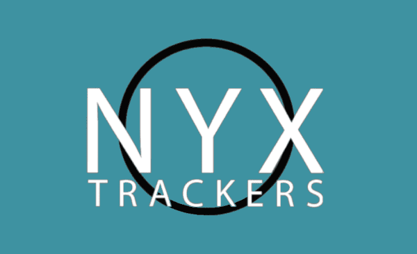

<!-- Improved compatibility of back to top link: See: https://github.com/othneildrew/Best-README-Template/pull/73 -->

<!--
*** Thanks for checking out the Best-README-Template. If you have a suggestion
*** that would make this better, please fork the repo and create a pull request
*** or simply open an issue with the tag "enhancement".
*** Don't forget to give the project a star!
*** Thanks again! Now go create something AMAZING! :D
-->

<!-- PROJECT SHIELDS -->
[![MIT License][license-shield]][license-url]
[![LinkedIn][linkedin-shield]][linkedin-url]
[![Fiverr][fiverr-shield]][fiverr-url]
[![Gmail][gmail-shield]][gmail-url]

<!-- PROJECT LOGO -->
 

  

<h3 align="center">NYX Trackers</h3>

  

    Client's landing page for sell trackers, made with react
     
     
    <a href="https://www.nyxtrackers.com/">View Page</a>
    ·
    <a href="https://github.com/darideveloper/repo_name/issues">Report Bug</a>
    ·
    <a href="https://github.com/darideveloper/repo_name/issues">Request Feature</a>
  

<!-- TABLE OF CONTENTS -->

  
Table of Contents

  <ol>
    <li>
      <a href="#about-the-project">About The Project</a>
      <ul>
        <li><a href="#built-with">Built With</a></li>
      </ul>
    </li>
    <li><a href="#roadmap">Roadmap</a></li>
    <li><a href="#license">License</a></li>
    <li><a href="#contact">Contact</a></li>
    <li><a href="#acknowledgments">Acknowledgments</a></li>
  </ol>

<!-- ABOUT THE PROJECT -->
## About The Project

[![Web page Screenshot][product-screenshot]](webpage)

Client's landing (single page application) page for sell trackers, made with react js

### Built With

<!-- ROADMAP -->
## Roadmap

- [x] Desktop layout
- [x] Mobile layout
- [x] Hover animations
- [x] Experience gallery
- [x] Slider
- [x] Domain
- [x] Hosting

See the [open issues](https://github.com/darideveloper/repo_name/issues) for a full list of proposed features (and known issues).

<!-- LICENSE -->
## License

Distributed under the MIT License. See `LICENSE` for more information.

<!-- CONTACT -->
## Contact

Darideveloper - [@developerdari](https://twitter.com/developerdari) - darideveloper@gmail.com.com

Project Link: [https://github.com/darideveloper/repo_name](https://github.com/darideveloper/repo_name)

<!-- MARKDOWN LINKS & IMAGES -->
<!-- https://www.markdownguide.org/basic-syntax/#reference-style-links -->
[contributors-shield]: https://img.shields.io/github/contributors/darideveloper/repo_name.svg?style=for-the-badge
[contributors-url]: https://github.com/darideveloper/repo_name/graphs/contributors
[forks-shield]: https://img.shields.io/github/forks/darideveloper/repo_name.svg?style=for-the-badge
[forks-url]: https://github.com/darideveloper/repo_name/network/members
[stars-shield]: https://img.shields.io/github/stars/darideveloper/repo_name.svg?style=for-the-badge
[stars-url]: https://github.com/darideveloper/repo_name/stargazers
[issues-shield]: https://img.shields.io/github/issues/darideveloper/repo_name.svg?style=for-the-badge
[issues-url]: https://github.com/darideveloper/repo_name/issues
[license-shield]: https://img.shields.io/github/license/darideveloper/repo_name.svg?style=for-the-badge
[license-url]: https://github.com/darideveloper/repo_name/blob/master/LICENSE.txt
[linkedin-shield]: https://img.shields.io/badge/-LinkedIn-black.svg?style=for-the-badge&logo=linkedin&colorB=555
[linkedin-url]: https://www.linkedin.com/in/francisco-dari-hernandez-6456b6181/
[product-screenshot]: ./public/screenshot.png
[gmail-url]: mailto:darideveloper@gmail.com
[fiverr-url]: https://www.fiverr.com/darideveloper
[gmail-shield]: https://img.shields.io/badge/-gmail-black.svg?style=for-the-badge&logo=gmail&colorB=555&logoColor=white
[fiverr-shield]: https://img.shields.io/badge/-fiverr-black.svg?style=for-the-badge&logo=fiverr&colorB=555&logoColor=white

Last code update: <time datetime="2022-11-29" class="last-update">2022-12-17</time>
